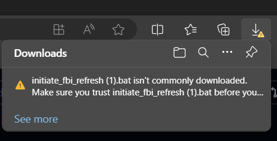
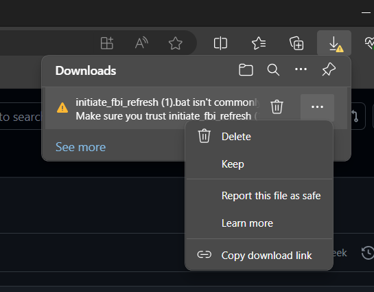
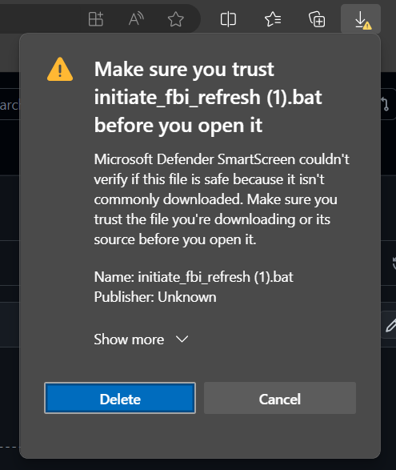
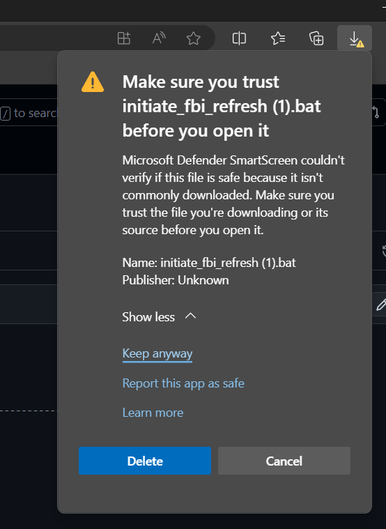
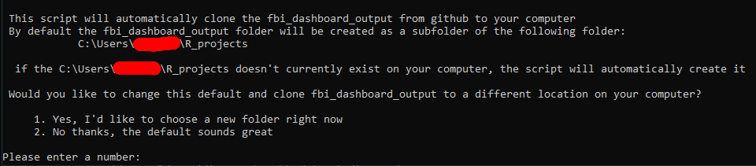
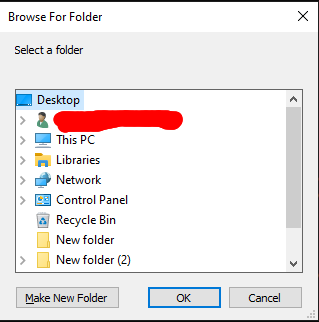
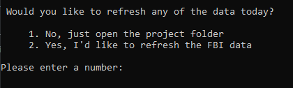

# Batch scripts
Here's a template for the the batch scripts we use to setup R environments and run data processing R scripts....automatically!           

        
The following instructions can be copied and pasted into your repository's readme file as markdown code. Open a pull request or issue on github to suggest changes to the batch script or the documentation. 

       

Batch scripts allow for the automation of a variety of windows tasks such as installing and running programs and creating new folders. We have developed batch scripts that      

1. Automatically install all the software you need to run our data refresh scripts and
2. Automatically run the refresh pipelines

Here's how to use them!

## Step-by-Step Guide: Re-run the data processing scripts after the data changes

 

           
 
### $\text{\color{green}Automatically set up and run the project using batch scripts}$          

          

           
 
# Batch files instructions

<h2 align="center">Prerequisite steps</h2>         

## Step 1: Create a GitHub account             
        

              
Creating a personal account should be pretty easy. If you need to connect to your organization's github page, you'll have to contact your organazation's admin to get a user licence and join the correct github groups.🙂     

         

               

   

## Step 2: Create a GitHub personal access token (PAT)           
      

             

A personal access token acts as a password to your Github account and allows you to clone a copy of repositories onto your personal computer, pull in changes someone else made from github, and push any changes you made to github.               
Instructions for creating a personal access token are available <a href="https://docs.github.com/en/enterprise-server@3.6/authentication/keeping-your-account-and-data-secure/managing-your-personal-access-tokens">here</a>.               

Do the following when creating a token:        
- Choose the <strong>$\text{\color{purple}classic token}$</strong> option
- Set the expiration date to <strong>$\text{\color{purple}90 Days}$</strong>
- Select $\text{\color{purple}all the scopes}$

After you've created the PAT, <strong>$\text{\color{purple}copy and paste it into a blank text document}$</strong>. You'll need it in a few steps.              

       
         

           
 

        
        
## Step 3: Run the <code>.bat</code> file 
        

download the batch file that you want to run. Here's an example  <a href="IF THIS LINK DOESN't WORK IT'S BECAUSE I FORGOT TO ADD IT :D">batch script</a>.        

If you are using edge as your web browser, you may see a warning when you download the file. Expand the $\text{\color{purple}Downloading batch filles on Edge}$ section below to learn how to deal with these errors:        

        

                    
             
### $\text{\color{purple}Downloading batch files on Edge}$         

           
When you download the file on Edge, you may see a warning in your downloads that looks like this:        
        

Hover over the file to see three dots `...`           
            

click on the three dots and choose the `keep` option           
          

After this message appears, expand the `Show more` arrow           
        

Then click on the `Keep anyway` option        
         

The file should now download!

After the file downloads, find the file in your downloads folder and and then double click on it to run the script:
       

<image src="images/run_fbi.png">
          

When this window pops up, click on `more info`      

<image src="images/more_info.png">
          

Then click `run anyway`       

<image src="images/run_anyway.png">

<h2 align="center">While the software is running</h2>
After the script starts running, there are a few things that may require your input. Here's how to deal with them!              
Depending on your current setup, you may not see all of these things.

            
     
## Install R   

If R is not currently installed on your computer, the script will attempt to install version 4.4.0 from the company portal. If this doesn't work you may need to install R manually. Depending on your organization's install policies you may be able to modify this script to use winget to install R. (Although currently winget only has up to <a href="https://winget.run/pkg/RProject/R">version 4.2.2</a>, and I wouldn't recommend that version because it doesn't have the patch for a <a href="https://security.berkeley.edu/news/cve-2024-27322-vulnerability-r-programming-language">security</a> <a href="https://hiddenlayer.com/research/r-bitrary-code-execution/">vulnerability</a> that was fixed in R version 4.4.0).  After R is installed, re-run the batch script.                  
            

       
        
## Enter your password when installers launch       

This script checks your computer for git and Rtools and installs them if they're missing. If an installer window launches, enter your password. The installer needs admin rights to work properly and needs your password to enter admin mode. 

       
        
## Re-run the script after git installs       

If the script installs git on your machine for the first time you will need to close the command prompt window and double click on the batch script file again to complete the installation. If the script stops running and you see this message, close the command prompt window and re-run the script.    

<image src="images/close_window.png">

       
        
## Rtools error?... Ignore and continue        

The script will automatically install Rtools. If during installation, you see this error, just click <code>Ignore this error and continue</code>:       

<image src="images/registry_key_error.png">
 

You do not need to close and re-run the script after Rtools is done installing like you do for git

       
        
## Use your PAT when asked to login to github        

If you have not previously connected git on your computer to your github account you will be prompted to login to github. That window looks like this:      

<image src="images/sign_into_browser.png">
       

Click on the <code>token</code> column on the right and then enter the personal access token that you created in step 2 in the box and click <code>Sign in</code>

<image src="images/provide_token.png">
       

       

## Choose a project folder
 
     

By default the script will download all the files you need from GitHub to a folder on your computer called <code>C:/users/[YOUR USERNAME]/R_projects</code>. If the folder doesn't already exist the script will create it. You also have the option to change the default location. To change choose option 2 when you see this screen:         
            

Choose 1 to launch a window that lets you choose a new folder.         
Choose 2 to continue running the script using the default location.           

If you choose to use a new folder, the following window will pop up:          
        

Choose a new folder then click ok. If you click cancel the script will exit silently and you will need to rerun the batch script. The `Make New Folder` option hasn't been extensively tested, so if you'd like to create a new folder, it's recomended that you first exit the script, manually create the new folder, then rerun the batch script and choose the new folder you created.  

          

             

        
       
## Refresh data?              

After all the required software is downloaded and configured, you will see the following prompt asking you if you'd like to refresh the data                    
                 
Choose 1 to exit the script and view the project folder           
Choose 2 to refresh the data       
           
If you choose option 2, the batch script will automatically run the R scripts contained in the repository to refresh the data. You specify the r script to run in the batch script on line 704. 

<h2 align="center">Subsequent refreshes</h2>

      
     
## Rerun the <code>initiate_fbi_refresh.bat</code> script in the project folder 
     

The first time you run the script it will create a project folder. Inside the project folder there will be a copy of the batch script. To refresh the data, just navigate to the project folder and double click on the batch script.                  
              
                
 <em>You should use the version of the script stored in the project folder <strong>not</strong> the version you downloaded from GitHub or Teams the first time.</em>      

<h2 align="center">Suggestions?</h2>
        
Pull requests are welcome!             

        

